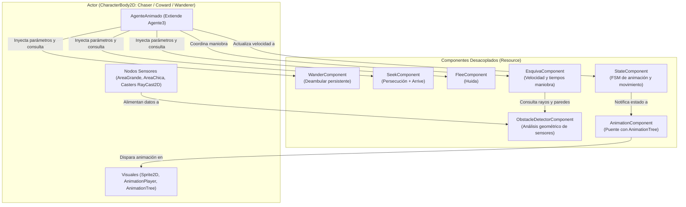
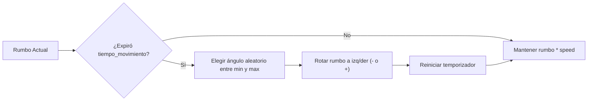
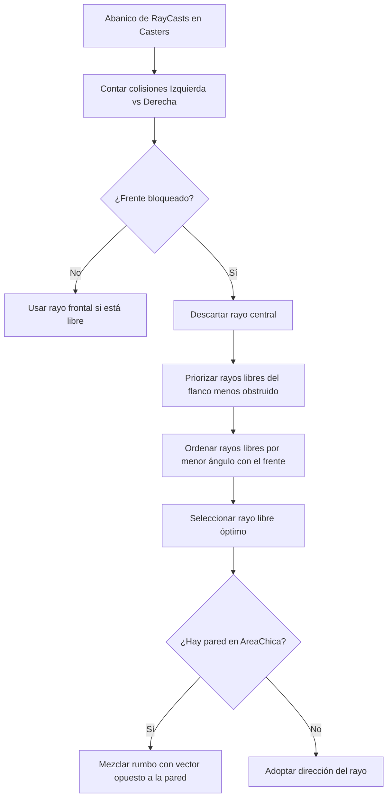
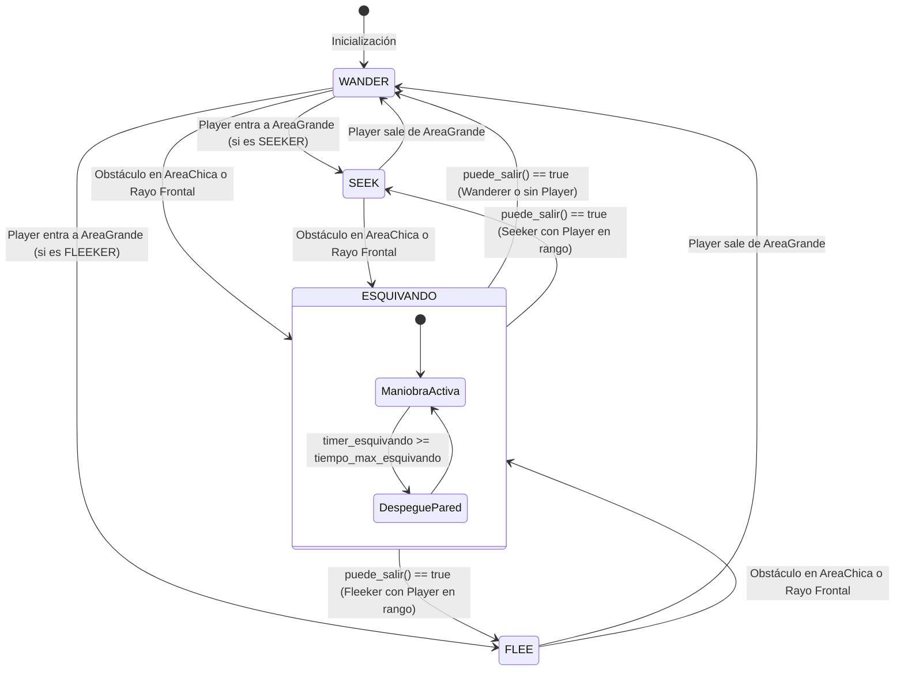

# Informe Técnico y Arquitectura de Componentes de IA (Godot 4)
**Proyecto:** Métodos Inteligentes  
**Fecha:** Septiembre 2026  
**Propósito del Documento:** Explicar de forma clara, técnica y pedagógica la estructura modular de componentes, el funcionamiento de la Inteligencia Artificial (Steering Behaviors y Evasión) y el significado exacto de cada parámetro para que cualquier integrante del equipo pueda comprender y defender el proyecto.

---

## 1. Fundamentos: Arquitectura Basada en Recursos (`extends Resource`)

En Godot tradicional, muchos desarrolladores crean "componentes" como nodos hijos (`Node` o `Node2D`) colgados del árbol de la escena. En este proyecto se utilizó un patrón más avanzado y limpio: **Componentes basados en `Custom Resource` (`extends Resource`)**.



### ¿Por qué se hizo así? (Ventajas clave para explicar)
1. **Desacoplamiento total y Principio de Responsabilidad Única (SRP):**
   - El actor (`CharacterBody2D`) se encarga de la física y la orquestación (`move_and_slide()`).
   - Los componentes contienen matemática y reglas puras (cálculo de vectores, temporizadores, lógica de frenado).
2. **Inyección de Dependencias (Actor Passing):**
   - Los componentes no asumen rutas duras de nodos (`$Casters` o `get_node(...)`), sino que reciben las referencias o vectores por parámetro (`procesar_maniobra(actor, delta, detector, casters, ...)`). Esto permite reutilizar el mismo componente en cualquier entidad sin que se rompa.
3. **`resource_local_to_scene = true`:**
   - **Dato crucial:** En Godot, los recursos se comparten por defecto en memoria entre todas las instancias. Si no se activa esta propiedad, todos los enemigos compartirían el mismo temporizador y la misma dirección. Al configurarlo en `true` en el `_init()`, cada enemigo tiene su propia memoria y temporizadores independientes.

---

## 2. Catálogo Detallado de Componentes

### 2.1. `WanderComponent` (Deambuleo Suave y Persistente)
*Archivo:* `Enemigos/scripts/wander_comp.gd`

#### ¿Cómo se comporta?
En lugar de cambiar de dirección bruscamente en cada tick de física (lo que causaría un temblor o vibración errática), este componente elige un rumbo y **lo sostiene durante un tiempo configurable** (`tiempo_movimiento`). Cuando el temporizador expira, calcula un giro angular dentro de un cono permitido y continúa avanzando.



#### Parámetros explicados:
| Parámetro | Tipo | Qué hace | ¿Qué pasa si lo modificás? |
| :--- | :--- | :--- | :--- |
| `speed` | `float` | Velocidad lineal con la que deambula el agente. | Si sube, camina más rápido en reposo. |
| `tiempo_movimiento` | `float` | Cuántos segundos avanza en línea recta antes de reconsiderar hacia dónde girar. | Si es muy chico (ej. `0.2s`), el enemigo parece indeciso y tiembla. Si es grande (ej. `3.0s`), camina con determinación en trayectorias largas. |
| `angulo_min_variacion` | `float` (grados) | El giro mínimo que hará al cambiar de rumbo (ej. `15°`). | Evita que el nuevo rumbo sea prácticamente idéntico al anterior. |
| `angulo_max_variacion` | `float` (grados) | El giro máximo que puede hacer en una sola variación (ej. `60°`). | Si es `180°`, el enemigo puede dar media vuelta de golpe. Si es `45°`, hace giros suaves y orgánicos. |
| `direccion_objetivo` | `Vector2` | Vector unitario que marca el rumbo actual. | Es actualizado internamente o cuando el sistema de esquiva le asigna un nuevo rumbo seguro. |

---

### 2.2. `SeekComponent` (Persecución con Frenado Progresivo `Arrive`)
*Archivo:* `Enemigos/scripts/seek_comp.gd`

#### ¿Cómo se comporta?
Calcula el vector que va desde la posición actual del agente hacia la posición del objetivo (el jugador). Incorpora el algoritmo de **Arrive de Craig Reynolds**, que divide el espacio en tres zonas:
1. **Zona de carrera:** Lejos del objetivo $\rightarrow$ Máxima velocidad (`speed`).
2. **Zona de desaceleración:** Entre `arrive_stop_radius` y `arrive_slowing_radius` $\rightarrow$ La velocidad decae suavemente con una rampa lineal para no pasarse de largo.
3. **Zona de parada:** A menor distancia que `arrive_stop_radius` $\rightarrow$ Se detiene por completo (`Vector2.ZERO`) y emite `objetivo_alcanzado`.

```
[Agente] --------------> |--- Zona Arrive (frena) ---|--- Zona Parada (0 vel) --- [Objetivo]
                         ^ arrive_slowing_radius     ^ arrive_stop_radius
```

#### Parámetros explicados:
| Parámetro | Tipo | Qué hace | ¿Qué pasa si lo modificás? |
| :--- | :--- | :--- | :--- |
| `speed` | `float` | Velocidad punta al perseguir al jugador. | Define cuán rápido corre el cazador. |
| `suavizado` | `float` | Factor de interpolación (`lerp`) para girar hacia el objetivo. | Si es `0.0`, el enemigo gira instantáneamente hacia el jugador. Si es `5.0` a `15.0`, tiene inercia de giro (se siente más pesado y realista). |
| `arrive_habilitado` | `bool` | Activa o desactiva la física de frenado suave. | Si está en `false`, embiste al jugador a máxima velocidad constante. |
| `arrive_slowing_radius` | `float` (px) | Distancia a la cual empieza a frenar. | Debe ser mayor que `arrive_stop_radius`. Si es muy chico, frena de golpe; si es amplio (ej. `120px`), la desaceleración es cinematográfica y fluida. |
| `arrive_stop_radius` | `float` (px) | Distancia a la que se clava en el lugar. | **Fundamental:** Si este radio es `0`, el enemigo intenta ubicarse exactamente en el centro del jugador, provocando temblores u oscilaciones adelante/atrás. Con `30px - 40px`, se queda parado cara a cara. |

---

### 2.3. `FleeComponent` (Comportamiento de Huida / Cobarde)
*Archivo:* `Enemigos/scripts/flee_comp.gd`

#### ¿Cómo se comporta?
Es el inverso matemático exacto de Seek: calcula el vector que apunta **en dirección contraria** a la amenaza (`posicion_actual - posicion_amenaza`). Además monitorea si el agente logró poner suficiente distancia de por medio (`distancia_segura`).

#### Parámetros explicados:
| Parámetro | Tipo | Qué hace | ¿Qué pasa si lo modificás? |
| :--- | :--- | :--- | :--- |
| `speed` | `float` | Velocidad de escape. | Determina qué tan rápido corre para alejarse. |
| `suavizado` | `float` | Interpolación de giro al huir. | Al igual que en Seek, evita giros a 180° instantáneos cuando el jugador se mueve en círculos. |
| `distancia_segura` | `float` (px) | Umbral de seguridad donde emite la señal `a_salvo`. | Si la distancia a la amenaza supera este valor, el agente considera que ya no corre peligro inminente. |

---

### 2.4. `EsquivaComponent` (Gestor de la Maniobra de Evasión)
*Archivo:* `Enemigos/scripts/esquiva_comp.gd`

#### ¿Cómo se comporta?
Este componente gestiona **el tiempo y la velocidad de la maniobra de escape**, trabajando en equipo con el `ObstacleDetectorComponent`. Resuelve dos de los problemas más difíciles en IA 2D:
1. **Evitar oscilaciones (Histéresis):** Sin este componente, un NPC que ve un obstáculo gira, el obstáculo sale de su cono de visión, intenta volver al rumbo original, vuelve a ver el obstáculo y entra en un bucle espasmódico. `tiempo_min_esquivando` obliga al NPC a comprometerse con la evasión unos instantes.
2. **Desatasque contra esquinas/paredes:** Si el agente queda atrapado contra una pared durante mucho tiempo continuo, `tiempo_max_esquivando` fuerza una maniobra de despegue radical.

#### Parámetros explicados:
| Parámetro | Tipo | Qué hace | ¿Qué pasa si lo modificás? |
| :--- | :--- | :--- | :--- |
| `speed` | `float` | Velocidad con la que esquiva obstáculos. | Suele ponerse igual o algo mayor a la velocidad base para que esquive con agilidad. |
| `suavizado` | `float` | Suavizado al adoptar el nuevo rumbo libre. | Si es `0.0`, cambia inmediatamente al rayo libre seleccionado. |
| `tiempo_min_esquivando` | `float` (seg) | Duración mínima obligatoria que el agente permanecerá esquivando antes de evaluar si vuelve a su estado normal. | **Evita el parpadeo de estados.** Si ves que el enemigo duda frente a una pared, elevar este valor a `0.35s` o `0.5s` ayuda a que supere el obstáculo con fluidez. |
| `tiempo_max_esquivando` | `float` (seg) | Tiempo límite continuo en esquiva. Al superarse, se activa el despegue forzado. | Si un enemigo se queda raspando una pared por más de este tiempo, el sistema lo obliga a despegarse en ángulo pronunciado hacia atrás/costado. |

---

### 2.5. `ObstacleDetectorComponent` (Sensor y Cerebro Geométrico)
*Archivo:* `Enemigos/scripts/detector_obstaculos_comp.gd`

#### ¿Cómo se comporta?
Es el componente más técnico y completo del proyecto. Analiza el abanico de sensores (`RayCast2D`) colocados en el nodo `Casters` del actor, junto con las colisiones del `AreaChica`. Realiza las siguientes tareas:
1. **Clasificación por grupos:** Distingue entre obstáculos generales (`Obstaculos`) y muros estáticos (`Pared`).
2. **Evaluación de flancos (Balanceo de colisiones):** Cuenta cuántos rayos colisionan a la izquierda versus a la derecha. Si hay más bloqueo a la derecha, prefiere girar hacia la izquierda.
3. **Selección del mejor RayCast:** Busca entre los rayos libres aquel que tenga **el menor desvío angular respecto al frente**, para esquivar rozando la trayectoria más eficiente posible. Si todos los frontales y laterales están tapados, recurre al rayo trasero (`RC_180`).
4. **Vector de rechazo de pared:** Calcula el vector promedio de todos los rayos que tocan pared, lo invierte y le aplica una variación angular para evitar rebotes frontales en bucle.
5. **Comprobación de paso por whiskers (`esta_direccion_obstruida`):** Lanza 3 rayos paralelos al ancho del cuerpo (`ancho_paso`) usando física directa (`PhysicsDirectSpaceState2D`) para verificar si el agente cabe físicamente antes de salir del estado de esquiva.



#### Parámetros explicados:
| Parámetro | Tipo | Qué hace | ¿Qué pasa si lo modificás? |
| :--- | :--- | :--- | :--- |
| `mascara_obstaculos` | `int` (Physics Flags) | Máscara de bits de colisión de física (por defecto `7` = capas 1, 2 y 3). | Define con qué capas del Collision Matrix de Godot interactúan los rayos de verificación matemática. |
| `distancia_anticipacion` | `float` (px) | Distancia en el cono frontal a partir de la cual el enemigo anticipa una colisión y entra en esquiva antes de tocar el obstáculo. | Si es muy alta (ej. `120px`), esquiva con mucha timidez desde lejos. Si es chica (ej. `40px`), espera al último segundo. En `60px` funciona en perfecta sintonía con `AreaChica`. |
| `ancho_paso` | `float` (px) | Distancia lateral entre los rayos paralelos usados para chequear si el personaje cabe por un pasaje. | Debe ser aproximadamente el radio de la cápsula de colisión del enemigo (`11px` a `15px`). |
| `distancia_verificacion_paso` | `float` (px) | Qué tan lejos hacia adelante prueban los 3 rayos paralelos de paso libre. | Distancia que debe estar despejada para considerar que la salida es segura. |
| `grupos_obstaculos` | `Array[StringName]` | Lista de nombres de grupos que representan colisiones esquivables (`[&"Obstaculos", &"Pared"]`). | Permite agregar nuevos tipos de obstáculos sin tocar el código. |
| `grupos_paredes` | `Array[StringName]` | Lista de nombres de grupos tratados específicamente como paredes rígidas (`[&"Pared"]`). | Cuando colisiona con uno de estos, se activa el algoritmo de despegue y repulsión de muros. |
| `indices_cono_frontal` | `Array[int]` | Índices de los RayCasts dentro de `Casters` que componen la visión frontal directa (`[0, 1, 2]`). | Son los primeros en chequearse para la advertencia anticipada. |
| `variacion_angulo_pared` | `float` (grados) | Amplitud de variación aleatoria aplicada al rebotar de una pared. | **Evita el 'ping-pong':** Si chocás una pared perpendicular y rebotás a exactamente 180°, volvés a chocar la pared de atrás. Este ángulo (ej. `40°`) rompe la simetría y permite salir de pasillos estrechos. |

---

### 2.6. Componentes de Estado, Animación y Player (`Player/Scripts/`)

#### `StateComponent`
*Archivo:* `Player/Scripts/state_component.gd`
- **Función:** Pequeña máquina de estados (`enum State { STATE_1, STATE_2, STATE_3, STATE_4 }`, correspondiente a `Idle`, `Run`, `Attack`, `Dead`).
- **Comportamiento:** Recibe el vector `motion` (la velocidad del personaje). Si `motion != Vector2.ZERO`, conmuta a `STATE_2` (Run). Si la velocidad se hace cero, conmuta a `STATE_1` (Idle).

#### `AnimationComponent`
*Archivo:* `Player/Scripts/animation_component.gd`
- **Función:** Conecta el `StateComponent` con el `AnimationTree` de Godot.
- **Comportamiento:** Al recibir el estado actual (`STATE_1` o `STATE_2`), llama a `animation_playback.travel("idle")` o `animation_playback.travel("run")`, permitiendo transiciones suaves de sprites y frames.

#### `MovementComponent`
*Archivo:* `Player/Scripts/movement_component.gd`
- **Función:** Utilizado por el `Player` para mapear las teclas (`right`, `left`, `down`, `up`) mediante `get_motion()`. Contiene también implementaciones alternativas de Seek, Flee y Wander generador de puntos para pruebas aisladas.

---

## 3. Estructura de los Actores: `Agente3` y `AgenteAnimado`

La lógica de los NPCs no está escrita en escenas sueltas, sino estructurada en una jerarquía orientada a objetos:

```
CharacterBody2D (Godot)
       └── Agente3 (Cerebro FSM + Sensores + Coordinación de Componentes)
              └── AgenteAnimado (Agrega StateComponent + AnimationComponent + Flip Sprite)
                     ├── Chaser (Configurado como TipoNPC.SEEKER)
                     ├── Coward (Configurado como TipoNPC.FLEEKER)
                     └── Wanderer (Configurado como TipoNPC.WANDERER)
```

### 3.1. Máquina de Estados Finita (FSM) de `Agente3`



### 3.2. Sensores físicos en el Actor
Cada NPC cuenta con tres elementos sensoriales en su árbol de nodos:
1. **`AreaGrande` (`CircleShape2D`, radio ~300px):**
   - Máscara configurada para detectar al jugador.
   - Actúa como la "visión o escucha periférica". Al entrar el jugador, transiciona a `SEEK` o `FLEE`.
2. **`AreaChica` (`CircleShape2D`, radio ~41px):**
   - Máscara configurada para detectar obstáculos y paredes.
   - Es el sensor de impacto inminente. Si algo entra en esta área, **inmediatamente se interrumpe cualquier comportamiento y se pasa a `ESQUIVANDO`**.
3. **`Casters` (`Node2D` con 12 `RayCast2D`):**
   - Disposición en abanico (frente `RC_0`, laterales y trasero `RC_180`).
   - **Clave de diseño:** En cada `_physics_process()`, el nodo `Casters` rota automáticamente hacia la dirección deseada (`casters.rotation = dir_deseada.angle()`). De este modo, los rayos siempre exploran hacia donde el enemigo *quiere* ir.

---

## 4. Preguntas Frecuentes y Respuestas para el Equipo

Si algún compañero, evaluador o profesor pregunta sobre el funcionamiento, aquí están las respuestas a los puntos más comunes:

### P1: "¿Por qué el enemigo no tiembla ni se traba al llegar al jugador?"
> **Respuesta:** "Gracias al componente `SeekComponent`, que implementa la técnica de *Arrive*. Tiene dos radios: `arrive_slowing_radius` (donde empieza a desacelerar suavemente) y `arrive_stop_radius` (donde se frena por completo a 30-40px de distancia). Al detener el vector a esa distancia, se anula la vibración de punto muerto."

### P2: "¿Por qué cuando esquiva no vuelve a chocar enseguida la misma pared?"
> **Respuesta:** "Por dos mecanismos:
> 1. `tiempo_min_esquivando` en `EsquivaComponent` introduce histéresis: el agente no puede cancelar la esquiva prematuramente.
> 2. Al salir de la esquiva, `Agente3` toma la dirección libre calculada y se la pasa a `componente_wander.establecer_objetivo(dir_salida)`. Así, cuando regresa al estado de deambular, continúa alejándose en el ángulo despejado en lugar de volver a girar contra el muro."

### P3: "¿Qué pasa si un enemigo queda acorralado en una esquina entre dos paredes?"
> **Respuesta:** "El sistema tiene un fail-safe:
> 1. `ObstacleDetectorComponent` descarta los rayos bloqueados y evalúa `RC_180` (el rayo trasero) como tercera prioridad.
> 2. Si el tiempo continuo en esquiva supera `tiempo_max_esquivando` (ej. 1.2 a 3.0s), se dispara `forzar_despegue_pared()`, calculando el vector normal inverso de la pared con una perturbación angular (`variacion_angulo_pared`) para desatascarlo."

### P4: "¿Cómo sabe el Sprite si debe mirar a la izquierda o a la derecha?"
> **Respuesta:** "A través de `flip_h_loop()` en `AgenteAnimado`: evalúa `velocity.x`. Si es menor a `-0.5px/s`, activa `flip_h = true`. Si es mayor a `0.5px/s`, lo desactiva. El umbral de `0.5` evita parpadeos cuando la velocidad horizontal es casi nula."

---

## 5. Resumen de Archivos y Responsabilidades

| Archivo | Rol Principal |
| :--- | :--- |
| `Enemigos/scripts/wander_comp.gd` | Generación de rumbos aleatorios persistentes por tiempo y cono angular. |
| `Enemigos/scripts/seek_comp.gd` | Persecución hacia objetivos con frenado suave (*Arrive*). |
| `Enemigos/scripts/flee_comp.gd` | Huida en sentido opuesto a amenazas evaluando distancia segura. |
| `Enemigos/scripts/esquiva_comp.gd` | Temporizadores de maniobra (mínimo, máximo) y cálculo de velocidad de evasión. |
| `Enemigos/scripts/detector_obstaculos_comp.gd` | Evaluación matemática de rayos, flancos, paredes, whiskers y despegues. |
| `Enemigos/Navigation/agente_3.gd` | Orquestador base (`CharacterBody2D`) con FSM (`WANDER`, `SEEK`, `FLEE`, `ESQUIVANDO`). |
| `Player/Scenes/Base/Agente_Animado.gd` | Especialización de `Agente3` con `StateComponent`, `AnimationComponent` y orientación del sprite. |
| `Player/Scenes/Chaser.tscn` | Escena del Cazador (`TipoNPC.SEEKER`, textura roja). |
| `Player/Scenes/Coward.tscn` | Escena del Cobarde (`TipoNPC.FLEEKER`, textura morada). |
| `Player/Scenes/Wanderer.tscn` | Escena del Deambulador (`TipoNPC.WANDERER`, textura amarilla). |
| `Player/Scenes/player.gd` & `Player.tscn` | Jugador controlado por teclado con `MovementComponent`. |
